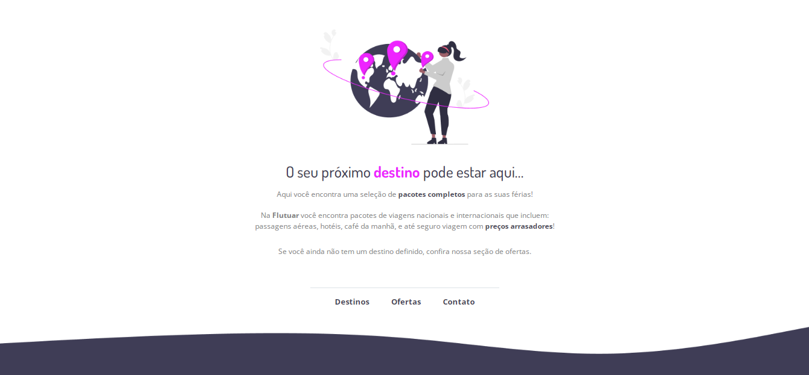

<h1 align="center"> Homepage - Agência de Viagens </h1>

  <a href="#-tecnologias">Tecnologias</a>&nbsp;&nbsp;&nbsp;|&nbsp;&nbsp;&nbsp;
  <a href="#-projeto">Projeto</a>&nbsp;&nbsp;&nbsp;|&nbsp;&nbsp;&nbsp;
  <a href="#memo-licença">Licença</a>

  

 

  

## 🚀 Tecnologias

Esse projeto foi desenvolvido com as seguintes tecnologias:

- HTML
- CSS
- Git e Github
- Figma

## 💻 Projeto

Desafio do Explorer - Recriando o layout de uma homepage de agência de viagens

- [Acesse o projeto finalizado, online](https://fernandoalvesrufino.github.io/homepage-agencia-de-viagens/)

## :memo: Licença

Esse projeto está sob a licença MIT.

---

by Fernando Rufino

> Projeto criado pela Rocketseat 
